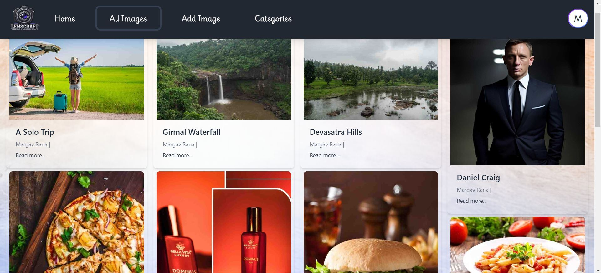
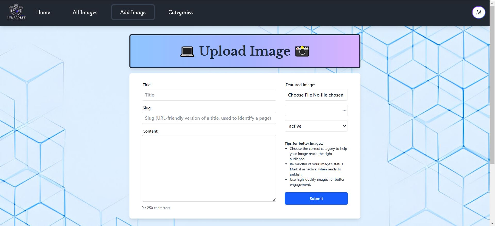
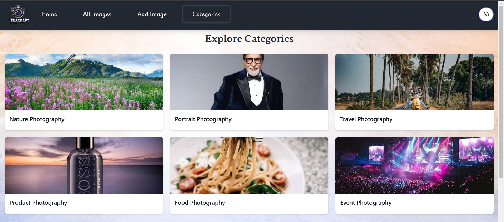

# LensCraft

**LensCraft** is a cutting-edge platform designed to streamline content management and publishing. Built with **React**, **Redux**, and **Appwrite**, LensCraft offers a modern and intuitive interface for seamless user experience. The platform provides a comprehensive suite of features, including secure user authentication, image creation tools, and robust image management capabilities. Whether you're a content creator, marketer, or designer, **LensCraft** empowers you to effortlessly manage your assets and publish high-quality content with ease.

## Features

- **User Authentication**: Secure login and access control powered by Appwrite, ensuring reliable and safe user management.
- **Upload Images**: Effortlessly upload new images with an intuitive interface.
- **Manage Images**: View, edit, and delete images, providing full control over your media assets.
- **Active and Inactive Images**: Filter and manage images based on their status, with inactive images visible only to the creator.
- **User Dashboard**: A personalized dashboard to efficiently manage and organize your content.

## Technology Stack

- **React**: A powerful JavaScript library for building dynamic, component-based user interfaces with a focus on performance and scalability.
- **Redux**: A predictable state management library for React applications, enabling seamless data flow and efficient state management across components.
- **Appwrite**: A comprehensive backend-as-a-service platform that provides robust authentication, real-time databases, and data storage solutions.
- **Tailwind CSS**: A utility-first CSS framework that enables rapid, customizable, and responsive design, ensuring consistency and flexibility in UI development.

## Screenshots

Below are visual previews of the LensCraft project, showcasing key features and the user interface:

  
  
  
  
  
  
  

